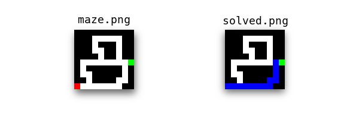

# Maze solver
Solves PNG maze file using my implementation Dijkstra's algorithm and PIL

## Usage
`maze.py [-h] [-i INPUT] [-o OUTPUT]`

INPUT defaults to "maze.png"
OUTPUT defaults to "solved.png"

## Example

Here, `maze.png` and `solved.png` are both 5px tall and 5px wide

## Colors
- **White** (#FFFFFF): Paths
- **Black** (#000000): Walls
- **Red** (#FF0000): Start
- **Green** (#00FF00): End
- **Blue** (#0000FF): Solution
